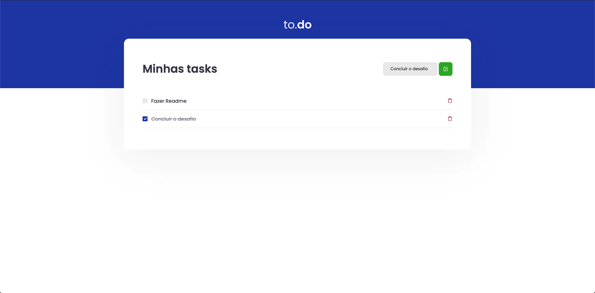

<br/>
<p align="center">
  
</p>

<h2 align="center"> 


</h2>
<br>

<p align="center">
<a href="#-tecnologias-usadas">Tecnologias usadas</a>&nbsp;&nbsp;&nbsp;|&nbsp;&nbsp;&nbsp;
<a href="#-desafios-do-projecto">Desafios do projecto</a>&nbsp;&nbsp;&nbsp;|&nbsp;&nbsp;&nbsp;
<a href="#-pré-requisitos">Pré-requisitos</a>&nbsp;&nbsp;&nbsp;|&nbsp;&nbsp;&nbsp;
<a href="#-como-rodar-o-projecto">Como rodar o projecto</a>
</p>
<p align="center">
     
</p>
<p align="center">
O <span>To.Do</span> é aplicativo para adiconar tarefas no estilo todo, que foi dado o template como desafio no Bootcamp Ignite da Rockeseat na trilha Reactjs para adicionar funcionalidades afim de aprender sobre os conceitos do Reactjs.
<!-- <p align="center">
     
</p> -->
<!-- <h1 align="center"><a target="_blank" href="https://letmeask-3fc59.web.app/">Acessar Demonstração</a></h1> -->
<!-- 
## ✅ Features
  - [x] Adicionar Tra
  - [x] Criar sala
  - [x] Compartilhar código da sala
  - [x] Destacar a pergunta que esta a ser a respondida
  - [x] Eliminar pergunta
  - [x] Encerrar sala -->


<p align="center">
  <!--  -->
</p>

---
## 🛠 Tecnologias usadas

As seguintes ferramentas foram usadas na construção do projeto:


- ReactJs
- Typescript
- SASS


---

## ⛈  Desafios do projecto
  - [x] Crie uma nova task com um id random, não permita criar caso o título seja vazio.
  - [x] Altere entre `true` ou `false` o campo `isComplete` de uma task com dado ID
  - [x]  Remova uma task da listagem pelo ID
 

---

## ⚠ Pré-requisitos

Antes de começar, você vai precisar ter instalado em sua máquina as seguintes ferramentas:
[Git](https://git-scm.com), [Node.js](https://nodejs.org/en/). 
Além disto é bom ter um editor para trabalhar com o código como [VSCode](https://code.visualstudio.com/)

---
## 🎲 Como rodar o projecto

```bash
# Clone este repositório
$ git clone <https://github.com/isaiasnhantumbo/desafio01-trilha-reactjs.git>

# Acesse a pasta do projeto no terminal/cmd
$ cd desafio01-trilha-reactjs

# Abra a pasta no Visual Studio Code
$ code .

# Instale as dependência
$ yarn

# Execute a aplicação com o yarn
$ yarn dev

# O servidor inciará na porta:8080 - acesse <http://localhost:8080>
```

---


## 📘 Licença
Este projecto usa a  [MIT License](LICENSE).
****
<h1 align="center">
👨🏽‍🏫 
<br>
Desenvolvido por
<br>
 Isaias Nhantumbo Junior
</h1>
</p>
<h1 align="center"> 🤝 &nbsp;Vamos nos conectar ?👨 </h1>

<p align="center">
<a href="https://www.youtube.com/channel/UCOyeYkH0MwJ6RrXTcEFFdAQ?view_as=subscriber"></a>
<a href="https://www.linkedin.com/in/isaias-nhantumbo-junior-733bb619b/"></a>
<a href="https://www.instagram.com/isaias_nhantumbo/"></a>
</p>
